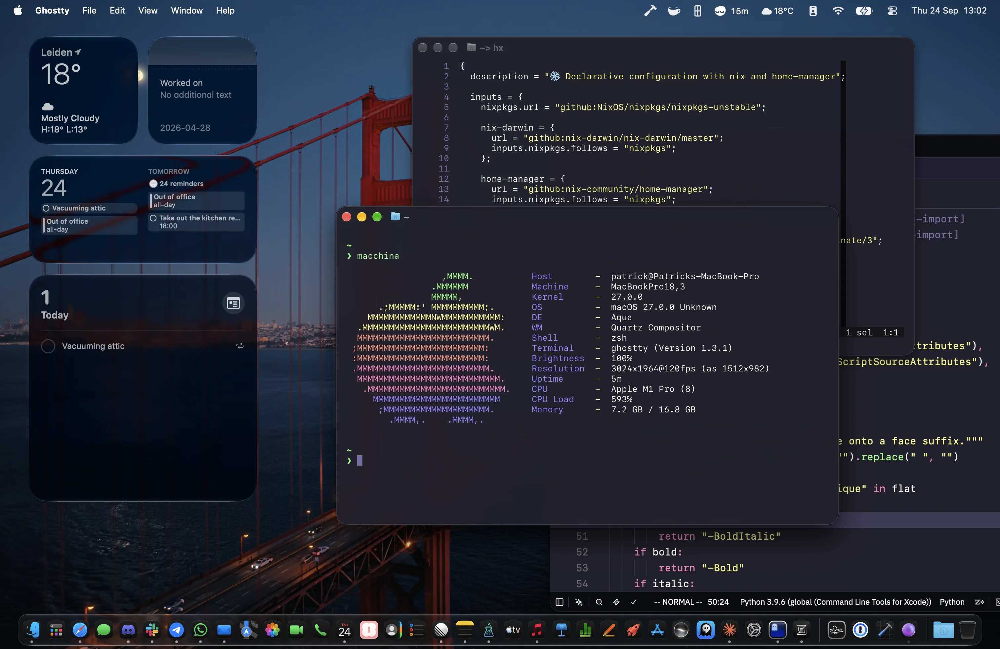
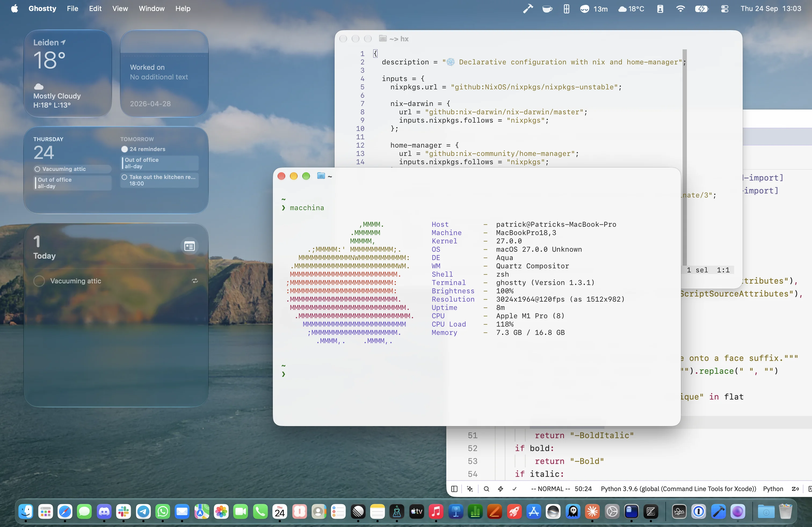

<!-- The header block is the one place this file departs from the rules:
     a centred layout needs inline HTML, and the badge and link URLs
     cannot be wrapped. -->
<!-- markdownlint-disable MD013 MD033 MD041 -->

<div align="center">
  nix-config
  <br />
  <br />
  <a href="https://github.com/pgodschalk/nix-config/issues/new?labels=&template=bug_report.md">Report a Bug</a>
  ·
  <a href="https://github.com/pgodschalk/nix-config/issues/new?labels=&template=feature_request.md">Request a Feature</a>
</div>

<div align="center">
<br />

[](LICENSE)
[](https://github.com/pgodschalk/nix-config/issues?q=is%3Aissue+is%3Aopen)
[](https://github.com/pgodschalk)

</div>

<div align="center">
<br />
  
  
</div>

<details open="open">
<summary>Table of Contents</summary>

- [About](#about)
  - [Built with](#built-with)
- [Getting started](#getting-started)
  - [Prerequisites](#prerequisites)
  - [Installation](#installation)
- [Usage](#usage)
- [Roadmap](#roadmap)
- [Support](#support)
- [Contributing](#contributing)
- [Authors \& contributors](#authors--contributors)
- [Security](#security)
- [License](#license)
- [Acknowledgements](#acknowledgements)

</details>

<!-- markdownlint-enable MD013 MD033 MD041 -->

---

## About

My Nix configuration, declared end to end: the system, the user environment,
every app's settings, and the toolchain behind them. One `darwin-rebuild switch`
reproduces the machine.

Two things shape it. **Apple's file-system hierarchy comes first** -- user state
belongs under `~/Library`, not in dotfiles, and a tool that can be told where to
put its state is told. And **the editor and CI agree**: the linters, formatters
and schemas that run on save are the same ones the checks run, so a file that is
clean in Zed is clean on a pull request.

The macOS half and the portable half are split by directory rather than by a
guard inside each module, so a future NixOS or WSL host simply never imports the
macOS half. A throwaway Linux home-manager configuration exists purely to be
evaluated, which is what keeps that boundary honest.

### Built with

- [Nix] with flakes, installed and managed by [Determinate Nix]
- [nix-darwin] for system-level configuration
- [home-manager] for the user environment
- [brew-nix] for the few apps that exist only as Homebrew casks

## Getting started

### Prerequisites

- Apple silicon running macOS 27 or later.
- [Determinate Nix]. Verify with `nix --version` and `determinate-nixd status`.
- Xcode Command Line Tools, since GUI apps call `/usr/bin/git`.

No Homebrew and no Rosetta: neither is installed, and neither is wanted.

### Installation

This configuration names one host and one user, so it will not apply to your
machine unchanged. To build it as-is:

```sh
git clone https://github.com/pgodschalk/nix-config
cd nix-config
nix build --override-input work path:./stubs/work \
  '.#darwinConfigurations.Patricks-MacBook-Pro.system'
```

`--override-input work path:./stubs/work` is required. The `work` input is a
private tree holding employer-specific configuration; `stubs/work` is an empty
stand-in so everything else still evaluates without it.

To adapt it, rename the host and the user everywhere they are spelled out:

- `modules/darwin/identity.nix`, which sets `networking.*`, to your own
  `scutil --get LocalHostName`;
- the `darwinConfigurations` attribute and the `checks` that name it in
  `flake.nix`, and the evaluation target in `.github/workflows/ci.yml`;
- the `hosts/` directory, and the user in its `default.nix`
  (`system.primaryUser`, `users.users`, `home-manager.users`) and under `home/`.

Then work through `apps.nix`.

### First activation

On a fresh Mac there is no `darwin-rebuild` yet and nothing points at the clone:

```sh
sudo -H ln -s "$PWD" /etc/nix-darwin
sudo -H nix run .#darwin-rebuild -- switch
```

The commands under Usage work from then on.

## Usage

`/etc/nix-darwin` is a symlink to this repository, which is why the commands
below need no `--flake` argument.

```sh
# Check that the configuration evaluates and builds, changing nothing:
darwin-rebuild build

# Apply it. `-H` sets HOME to root's, so nothing root-owned lands in ~:
sudo -H darwin-rebuild switch

# Undo the last switch:
sudo -H darwin-rebuild --rollback
```

Flakes only see files that git knows about, so `git add` a new file before
building or you will get a "path does not exist" error naming the file rather
than the cause.

Updating inputs:

```sh
nix flake update             # everything
nix flake update nixpkgs     # packages
nix flake update brew-api    # cask versions, which expire and need refreshing
```

### Layout

| Path                   | What it is                                    |
| ---------------------- | --------------------------------------------- |
| `flake.nix`            | Inputs and outputs                            |
| `apps.nix`             | **Edited most**: App Store, casks, packages   |
| `hosts/<hostname>/`    | Platform, state version, primary user, wiring |
| `modules/darwin/`      | nix-darwin modules, system-level, macOS-only  |
| `modules/home/`        | home-manager modules, portable                |
| `modules/home/darwin/` | home-manager modules, macOS-only              |
| `home/patrick/`        | `common.nix` plus `darwin.nix` or `linux.nix` |
| `pkgs/`                | Derivations nixpkgs does not carry            |
| `lib/`                 | Helpers shared across modules                 |
| `stubs/work/`          | Empty stand-in for the private work layer     |

## Roadmap

See the [open issues][issues] for what is known to be missing. The larger
directions:

- NixOS hosts joining this flake, then WSL and devcontainers.

## Support

Open an [issue][issues]. This is a personal configuration maintained in spare
time, so answers are best-effort.

## Contributing

First off, thanks for taking the time to contribute. Any contribution is
appreciated and valued -- read [CONTRIBUTING.md](CONTRIBUTING.md) first, since a
repository describing one machine takes some kinds of change and not others.

Please adhere to this project's [code of conduct](CODE_OF_CONDUCT.md).

## Authors & contributors

The original setup of this repository is by
[Patrick Godschalk](https://github.com/pgodschalk).

For a full list of all authors and contributors, see [the contributors
page][contributors].

## Security

This project follows good practices of security, but 100% security cannot be
assured. It is provided **"as is"** without any **warranty**. Use at your own
risk.

For more information and to report security issues, please refer to the
[security documentation](SECURITY.md).

## License

This project is licensed under the **European Union Public Licence v1.2**.

See [LICENSE](LICENSE) for more information.

## Acknowledgements

- The [nix-darwin] and [home-manager] maintainers, whose option documentation is
  most of what makes this possible.
- [Determinate Systems], for a Nix installation that survives macOS upgrades.
- The README and contributing structure follows
  [amazing-github-template][template].

[Determinate Nix]: https://docs.determinate.systems/
[Determinate Systems]: https://determinate.systems/
[Nix]: https://nixos.org/
[brew-nix]: https://github.com/BatteredBunny/brew-nix
[contributors]: https://github.com/pgodschalk/nix-config/contributors
[home-manager]: https://github.com/nix-community/home-manager
[issues]: https://github.com/pgodschalk/nix-config/issues
[nix-darwin]: https://github.com/nix-darwin/nix-darwin
[template]: https://github.com/dec0dOS/amazing-github-template
